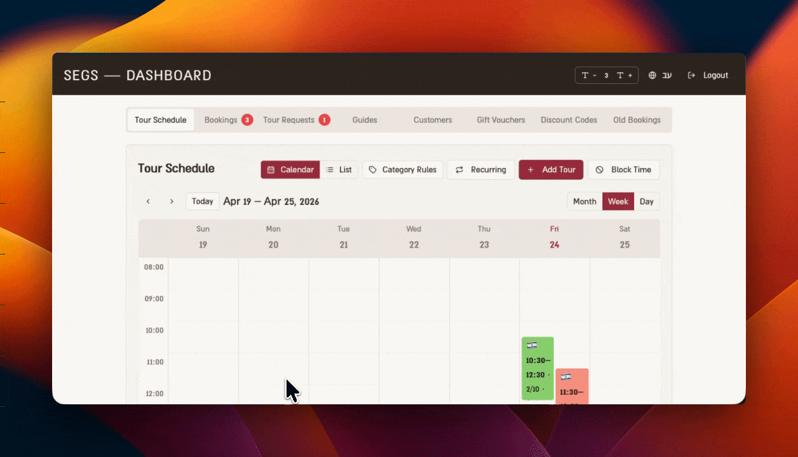

# SEGS – EZ Raider Tour Booking Platform

**A full-stack booking and management web application for a guided EZ Raider tour business in ancient Caesarea, Israel.**

> **Note:** This is a portfolio showcase of the project. The production codebase is private as it belongs to a real operating business.


---

## Table of Contents

- [The Business Need](#the-business-need)
- [Live Product Overview](#live-product-overview)
- [Screenshots](#screenshots)
- [Tech Stack](#tech-stack)
- [Key Features](#key-features)
- [Architecture](#architecture)
- [Database Design](#database-design)
- [What I Built & Learned](#what-i-built--learned)

---

## The Business Need

A small tour company in Caesarea, Israel runs guided rides on EZ Raider electric boards through ancient archaeological sites. Before this platform, the business had **no digital booking system** — everything was handled by phone or WhatsApp. This created problems:

- No visibility into tour slot availability
- Manual tracking of bookings in notes and spreadsheets
- No way to sell gift vouchers online
- Tour guides had no centralized view of their schedule
- No customer database or booking history

**The goal:** Build a complete, bilingual (Hebrew/English) booking platform that serves customers, guides, and admins — replacing manual processes with an automated, real-time system.

---

## Live Product Overview

The application has three distinct user roles and interfaces:

| Role | Interface | Access |
|------|-----------|--------|
| **Customer** | Public landing page + booking flow | Open |
| **Guide** | Guide dashboard (`/guide`) | Google OAuth |
| **Admin** | Full management dashboard | Google OAuth + Admin role |

---

## Demo


### Booking Flow


### Admin Dashboard

> **Note:** The admin dashboard contains real customer and business data. Only a partial view is shown here to protect the privacy of the business and its customers.



---

## Tech Stack

### Frontend
| Technology | Purpose |
|------------|---------|
| **React 18** + **TypeScript** | UI library + type safety |
| **Vite** | Build tool with HMR |
| **Tailwind CSS** | Utility-first styling |
| **shadcn/ui** (49 components) | Accessible, composable UI primitives (Radix-based) |
| **Framer Motion** | Smooth animations (hero zoom, section transitions) |
| **React Router v6** | Client-side routing |
| **React Hook Form** + **Zod** | Form state management + schema validation |
| **TanStack React Query** | Server state management and caching |
| **date-fns** | Date manipulation with Hebrew locale support |
| **Embla Carousel** | Responsive image gallery |
| **Sonner** | Toast notification system |

### Backend & Database
| Technology | Purpose |
|------------|---------|
| **Supabase** | PostgreSQL database, Auth, Edge Functions, Storage |
| **Supabase Auth** | Google OAuth with session persistence |
| **Supabase Edge Functions** | TypeScript/Deno serverless functions |
| **Supabase Realtime** | Live data sync via Postgres `LISTEN/NOTIFY` |
| **Row-Level Security (RLS)** | Fine-grained data access control |
| **Supabase Storage** | Gift card PDF generation and file uploads |

### Tooling
| Technology | Purpose |
|------------|---------|
| **Vitest** | Unit testing |
| **Playwright** | End-to-end testing |
| **ESLint** + **TypeScript ESLint** | Code quality and linting |

---

## Key Features

### Public Booking Flow

**Guided Tour Booking:**
1. Customer picks a date from a calendar
2. Available time slots load dynamically from the database
3. Customer selects a slot — sees the assigned guide's photo, languages, and bio
4. Enters participant count and personal details
5. Can apply a gift card or discount code (validated via Supabase RPC)
6. Booking is created via Edge Function with duplicate and capacity checks

**Gift Voucher Purchase:**
- Select ticket quantities for adult/child/senior
- Enter recipient info
- System generates a unique voucher code with a PDF download

**Tour Requests:**
- If no slots are available on a selected date, customers can submit a custom tour request
- Admin is notified in real time with a badge count

**Accessibility:**
- Font size toggle (small / normal / large) persisted in localStorage
- High-contrast mode
- Full keyboard navigation via shadcn/ui (Radix) components
- WCAG accessibility declaration page

---

### Admin Dashboard

A full CRM and operations management panel with real-time updates:

- **Tour Slots Manager** – Calendar (month/week/day views), color-coded slot categories, create/edit/delete slots, assign guides, manage blocked time ranges
- **Bookings Manager** – Table with filter by status (pending / approved / confirmed / rejected / cancelled), manual booking creation, external booking linking
- **Tour Requests Manager** – Review and action custom tour requests
- **Guides Manager** – Add/edit guide profiles with avatar, languages, Hebrew & English bios
- **Customers Manager** – View full customer list with booking history
- **Gift Cards Manager** – Issue gift cards, track remaining balance, set expiry dates
- **Discount Codes Manager** – Create percent or fixed-value codes for partners
- **Real-time Notifications** – Badge counts on tabs for unreviewed bookings and requests

---

### Guide Dashboard

A focused, lightweight view for tour guides:
- See only their assigned upcoming slots
- View confirmed and pending bookings for those slots
- Toggle between "my tours" and all active tours
- Auto-linked to their guide profile by Google OAuth email on first login

---

## Architecture

```
┌─────────────────────────────────────────────────────┐
│                     Client (React)                   │
│                                                     │
│  Landing Page          Admin Dashboard    Guide View │
│  ├─ Hero               ├─ Slots Mgr       ├─ My Tours│
│  ├─ Gallery            ├─ Bookings Mgr    └─ My Bookings
│  ├─ Booking Flow       ├─ Guides Mgr                 │
│  └─ Gift Vouchers      ├─ Gift Cards Mgr             │
│                        └─ Customers Mgr              │
│                                                     │
│  State: React Query (server) + useState (UI)        │
│  i18n:  Custom LanguageContext (HE/EN + RTL)        │
└────────────────────────┬────────────────────────────┘
                         │ HTTPS / WebSocket
┌────────────────────────▼────────────────────────────┐
│                     Supabase                         │
│                                                     │
│  ┌─────────────┐  ┌──────────────┐  ┌────────────┐ │
│  │  PostgreSQL  │  │ Edge Functions│  │ Realtime   │ │
│  │  + RLS       │  │ (Deno/TS)    │  │ Subscriptions│
│  └─────────────┘  └──────────────┘  └────────────┘ │
│                                                     │
│  ┌─────────────┐  ┌──────────────┐                 │
│  │   Auth       │  │  Storage     │                 │
│  │ Google OAuth │  │ PDFs/Images  │                 │
│  └─────────────┘  └──────────────┘                 │
└─────────────────────────────────────────────────────┘
```

### Key Architectural Decisions

**1. Supabase RPC for sensitive operations**
Gift card lookups and discount code validation use database stored procedures (`SECURITY DEFINER`) instead of direct table access — customers never touch the raw tables.

**2. Edge Functions for booking creation**
The booking creation flow runs through a Supabase Edge Function that validates capacity, checks for duplicates, and atomically inserts the booking — keeping business logic server-side.

**3. Custom i18n context instead of a library**
A hand-rolled `LanguageContext` gives full control over RTL layout direction, Hebrew date formatting, font family switching, and localStorage persistence without the overhead of i18next.

**4. Real-time admin notifications**
Supabase Realtime channels subscribed in the admin dashboard provide live badge counts for unreviewed bookings and requests — no polling required.

**5. Lazy-loaded page sections**
The main landing page uses `React.lazy()` + `Suspense` for each section, splitting the bundle and improving initial load time.

**6. Guide auto-linking by email**
When a guide logs in with Google OAuth, an Edge Function matches their email to a guide profile and auto-links the account — no manual admin step required.

---

## Database Design

**Core Tables:**

| Table | Purpose |
|-------|---------|
| `tour_slots` | Available tour time slots with capacity, category, language |
| `bookings` | Customer bookings linked to tour slots |
| `guides` | Guide profiles (name, bio, avatar, languages) |
| `tour_slot_guides` | Many-to-many: guides assigned to slots |
| `gift_cards` | Gift voucher codes with remaining balance and expiry |
| `discount_codes` | Partner discount codes (percent or fixed value) |
| `customers` | Customer records built from booking data |
| `tour_requests` | Custom tour requests from customers |
| `blocked_times` | Date/time ranges blocked by admin (holidays, etc.) |
| `category_rules` | Color-coded slot category definitions |
| `user_roles` | Admin/guide role assignments |

**Key Database Features:**
- Row-Level Security (RLS) policies on all tables
- Trigger on `bookings` to auto-update `current_participants` on tour slots
- Public RPC functions for gift card and discount code lookups (no auth required)
- 20+ versioned SQL migrations tracked in `/supabase/migrations`

---

## What I Built & Learned

### What I built:
- A complete full-stack web application from scratch for a real, operating business
- A multi-role system (customer / guide / admin) with Google OAuth and role-based routing
- A bilingual (Hebrew + English) UI with full RTL support, including proper date formatting, font families, and layout direction
- A real-time admin dashboard with live notifications using Supabase subscriptions
- A gift card system with PDF generation, code validation, and balance tracking
- A discount code system for business partners
- Database schema with RLS, triggers, and RPC functions for secure data access
- Responsive, accessible design supporting screen readers, keyboard navigation, font scaling, and high-contrast mode

### What I learned:
- Designing a real-world database schema with proper security policies (RLS)
- Managing complex form state with multi-step booking flows using React Hook Form + Zod
- Implementing i18n and RTL layout at the component level without a heavy library
- Using Supabase Realtime for live UI updates without polling
- Structuring a React app with multiple user roles and protected routes
- Building accessible UI components using Radix UI primitives (via shadcn/ui)
- Writing Supabase Edge Functions in Deno/TypeScript for secure server-side logic

---

## Project Status

The application is **live in production** and actively used by the business. Development is ongoing — features are added based on operational feedback from the business owner and guides.

---

*Built by Hili Mor | Portfolio project — production code is private*
